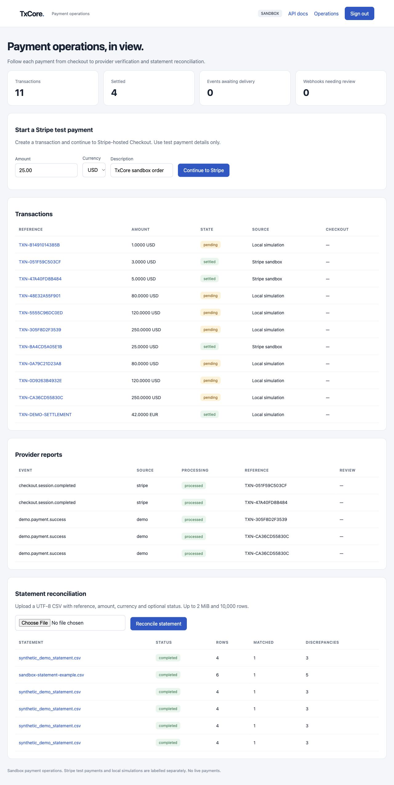
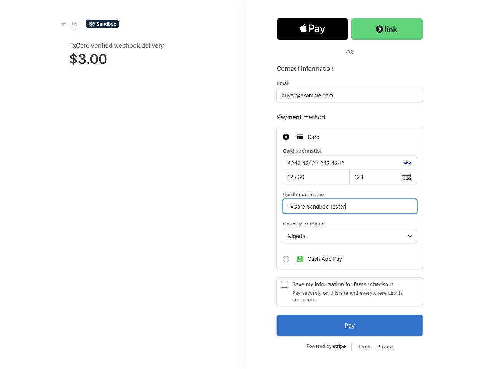
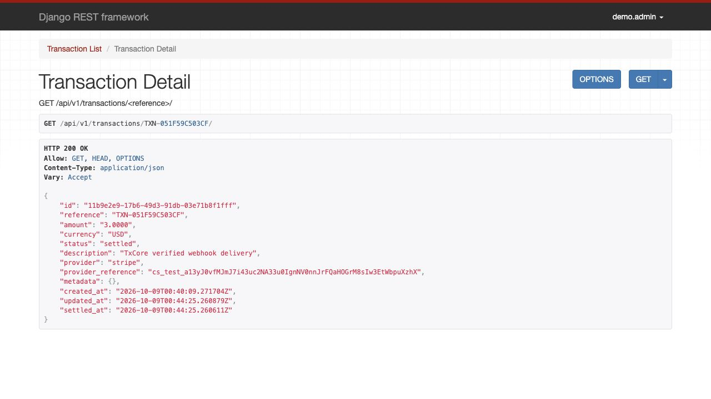
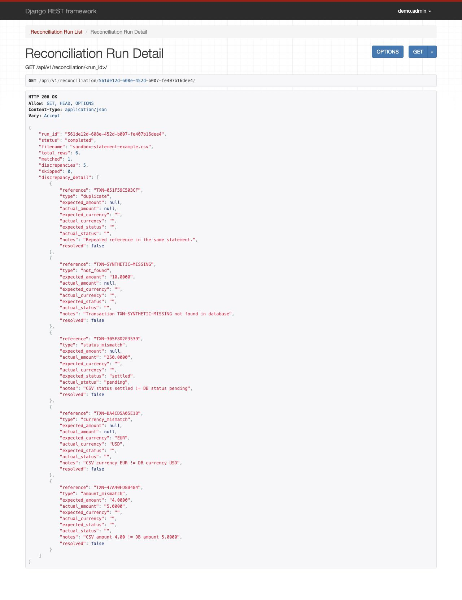
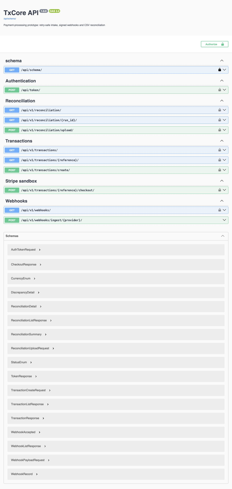
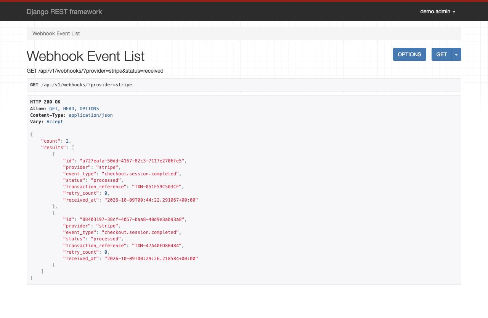
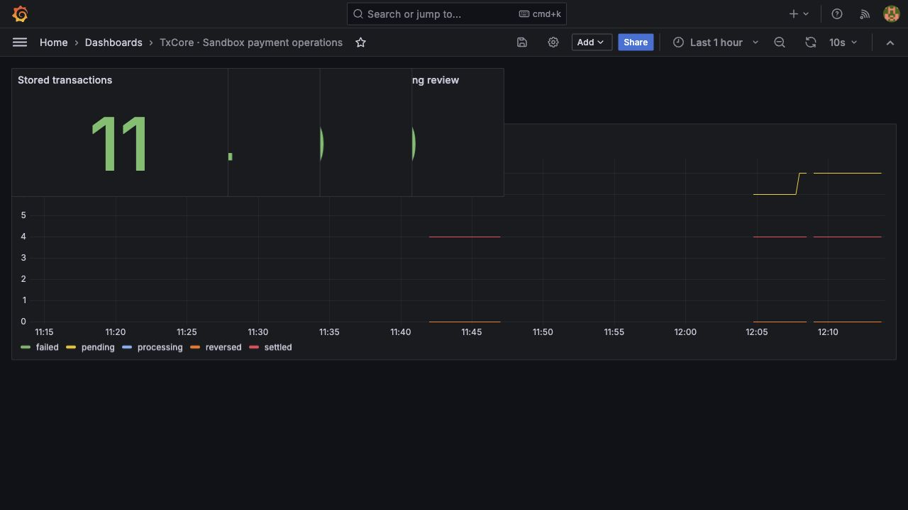
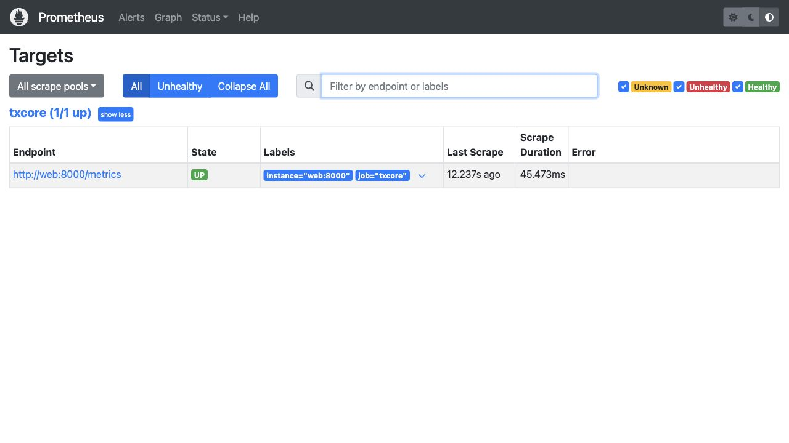
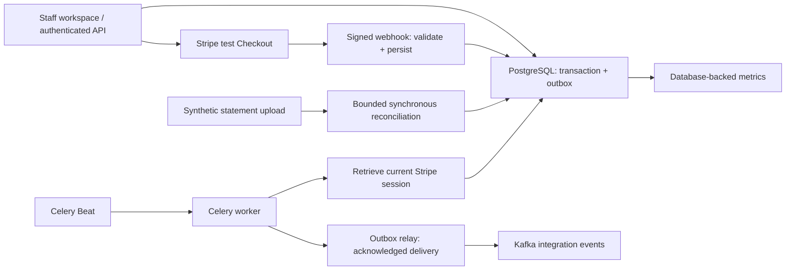

# TxCore

A payment operations sandbox built by **Donatus Gwer**: retry-safe payment intake, Stripe-hosted Checkout, verified provider events and explainable statement reconciliation.

[](https://github.com/Gwerdonatus/txcore/actions)

A checkout request can time out after a payment record already exists. A webhook can arrive twice, arrive late or never arrive. A statement can disagree with the local record. TxCore makes those failures visible and recoverable rather than assuming that a successful browser redirect means a successful payment.

This is a solo backend engineering project with a small authenticated operations workspace. Stripe integration uses **test mode only**. Local simulations are labelled separately. No real funds move, and `settled` means a verified paid Checkout session, not completed bank payout settlement.

## See the actual workflow

### 1. Sign in and inspect payment operations

The workspace brings transaction states, undelivered events, provider reports and statement results together. Staff accounts use session authentication; API clients use tokens. Session writes enforce CSRF protection.



### 2. Create a payment and use Stripe Checkout

The first request creates one transaction and its durable outbox event in the same database transaction. Retrying the same caller's key and body returns that record; reusing the key with another body returns **409**. Concurrent Checkout requests serialize around the transaction and reuse a stable Stripe idempotency key.



### 3. Verify provider state before marking payment paid

Stripe's timestamped signature is checked against the exact webhook bytes. Identified test events are stored once, acknowledged with **202**, then processed by a scheduled worker. The worker retrieves the current Checkout session and checks its reference, amount, currency, test-mode flag and payment state. A periodic scan can recover a paid session when webhook delivery was missed.



### 4. Inspect statement differences

A bounded CSV upload compares references, currencies, decimal amounts and optional statuses. Missing records, repeated references and mismatches produce inspectable evidence. The screenshot uses a deliberately altered **synthetic statement**, not a downloaded Stripe settlement statement.



<details>
<summary>API contract, provider reports and monitoring</summary>









</details>

[Screenshot provenance](docs/screenshots/README.md) · [Engineering decisions](docs/engineering-review.md) · [Repeatable walkthrough](docs/local-demo.md) · [Measured verification](docs/verification.md)

## Implemented behavior

| Area | What it does |
|---|---|
| Authentication | Staff workspace, session/CSRF protection and token-authenticated APIs |
| Idempotency | Caller-scoped database keys, normalized request fingerprints and conflicting-body rejection |
| Stripe sandbox | Hosted Checkout, stable provider keys, exact minor-unit validation and live-key rejection |
| Provider verification | Timestamped raw-byte signatures, duplicate-event protection and current-session validation |
| Recovery | Durable webhook retries and a scheduled scan for missed provider notifications |
| Event delivery | Transactional outbox, Kafka acknowledgements, backoff and stable event IDs |
| Reconciliation | Currency/amount/status differences, duplicate and missing references, explicit skipped rows |
| Operations | Celery worker/Beat, database-backed Prometheus gauges and provisioned Grafana dashboard |

## Execution path



Kafka provides a decoupled integration stream; **it does not trigger payment verification**. Celery polls the database for durable work, using Redis as its broker. A PostgreSQL outbox plus Celery would be enough for a smaller deployment; Kafka here demonstrates acknowledged event delivery to future independent consumers. No consumer or throughput advantage is claimed. Delivery is **at least once**, so consumers must deduplicate the supplied event ID.

## Run locally

The completed sandbox is on [`docs/recruiter-walkthrough`](https://github.com/Gwerdonatus/txcore/tree/docs/recruiter-walkthrough), in [PR #1](https://github.com/Gwerdonatus/txcore/pull/1) pending review.

```sh
git clone https://github.com/Gwerdonatus/txcore.git
cd txcore
git switch docs/recruiter-walkthrough
cp .env.example .env
chmod 600 .env
docker compose -p txcore config --quiet
docker compose -p txcore up -d --build --wait --wait-timeout 300
docker compose -p txcore exec web python manage.py setup_demo
python3 scripts/demo.py
```

That starts the local simulation without external payment credentials. For actual **Stripe test Checkout**, privately set `STRIPE_SECRET_KEY` in the ignored `.env`, then follow [the Stripe setup](docs/local-demo.md#stripe-test-checkout). API migrations run automatically at startup. Host ports bind to loopback; PostgreSQL and Redis remain private. The Nginx file is a deployment example, not a Compose service.

| Interface | Local URL |
|---|---|
| Workspace | http://localhost:8100/ |
| Login | http://localhost:8100/login/ |
| OpenAPI | http://localhost:8100/api/docs/ |
| Transactions | http://localhost:8100/api/v1/transactions/ |
| Provider reports | http://localhost:8100/api/v1/webhooks/ |
| Reconciliation | http://localhost:8100/api/v1/reconciliation/ |
| Prometheus | http://localhost:9091 |
| Grafana | http://localhost:3010/d/txcore-sandbox/ |

Local workspace: **demo.admin / TxCoreSandbox123!**. Grafana: **admin / admin**. These are development credentials; Compose is not configured for public deployment. `setup_demo` is DEBUG-only and preserves an existing password.

## Verification

**88 tests passed against PostgreSQL**, including concurrent intake and Checkout initialization. The SQLite coverage run passed **86 tests**, skipped the two PostgreSQL-specific tests, and measured **91.34% application coverage**. Provider calls are mocked in automated tests; a separate browser run completed actual Stripe test Checkout and verified fresh webhook delivery and processing.

```sh
docker compose -p txcore exec web python -m pip install flake8
docker compose -p txcore exec web flake8 txcore/ --max-line-length=110 --exclude=migrations
docker compose -p txcore exec web python manage.py check
docker compose -p txcore exec web python manage.py makemigrations --check --dry-run
docker compose -p txcore exec web python manage.py spectacular --validate --fail-on-warn --file /tmp/schema.yml
docker compose -p txcore exec -e DJANGO_SETTINGS_MODULE=txcore.test_settings web pytest --cov=txcore --cov-report=term-missing --cov-fail-under=80
docker compose -p txcore exec -e DJANGO_SETTINGS_MODULE=txcore.postgres_test_settings web pytest --no-cov
```

CI runs both database test configurations, schema validation and lint. No p95 latency, throughput or load-capacity claim is made.

## Boundaries

- This is a **single shared staff workspace**, not a multi-tenant payments service.
- It uses Stripe test credentials, not live charges, refunds, payouts or a double-entry ledger.
- CSV reports are synchronous, capped at 2 MiB and 10,000 rows. They are evidence comparisons, not automated accounting adjustments or compliance certification.
- Failed provider events remain visible for investigation; a manual retry/resolution workflow is not implemented.
- Kafka is a single development broker. Outbox recovery prevents silent loss, but publication can be duplicated after an acknowledgement/commit crash.
- Development secrets, DEBUG, HTTP and demo passwords must be replaced before deployment. The public schema/metrics endpoints would also need deployment-specific access controls.
- No external deployment, dependency security audit, PCI certification or production traffic claim is made.

## Repository map

| Path | Purpose |
|---|---|
| `txcore/apps/transactions` | Intake, Checkout, records, durable outbox and workspace templates |
| `txcore/apps/webhooks` | Provider signatures and persisted receipts |
| `txcore/apps/reconciliation` | CSV comparison and discrepancy evidence |
| `txcore/providers` | Stripe test SDK boundary |
| `txcore/workers` | Scheduled verification, recovery, delivery and demo-only settlement |
| `txcore/tests` | Regression and PostgreSQL concurrency suite |
| `scripts` | Asserted local HTTP demos and private listener configuration |
| `grafana` | Provisioned datasource and database-state dashboard |
| `docs` | Actual screenshots, decisions, walkthrough and verification |

**Donatus Gwer — Backend Engineer** · [GitHub](https://github.com/Gwerdonatus) · [LinkedIn](https://linkedin.com/in/donatus-gwer)
