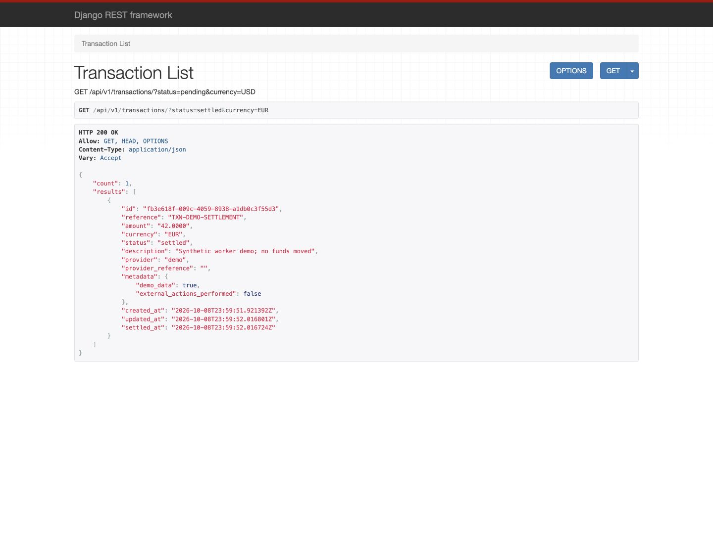
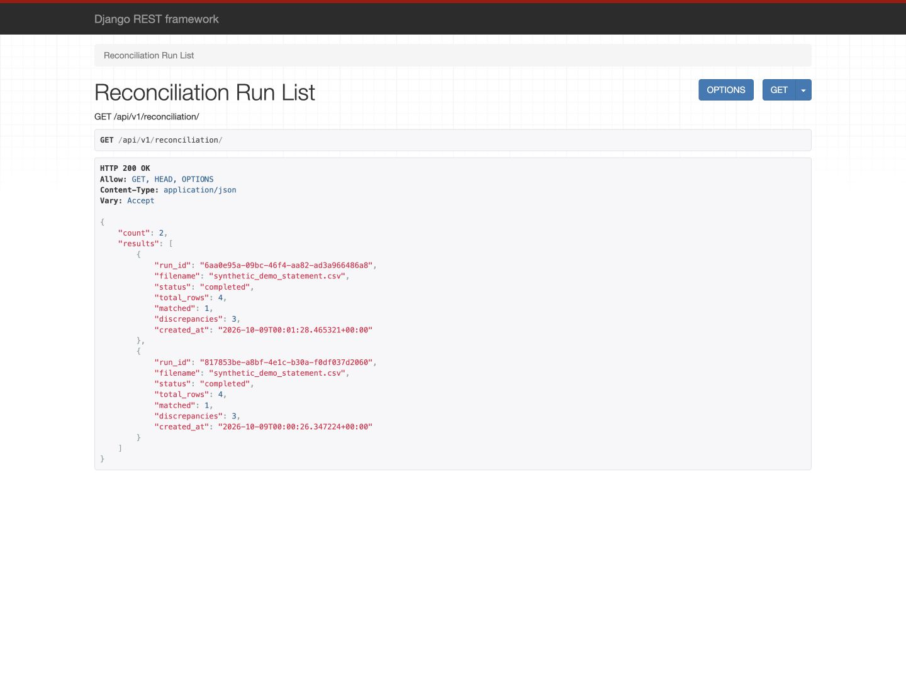
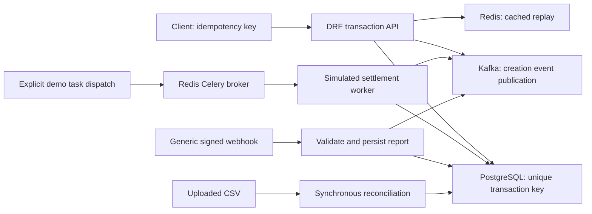

# TxCore

A payment-processing backend prototype focused on retry-safe transaction intake, signed webhook reporting and explainable CSV reconciliation.

[](https://github.com/Gwerdonatus/txcore/actions)

When a client times out, it may retry an order that already exists. Later, a provider report may disagree with the local amount or settlement status. TxCore explores those two problems: keeping transaction intake stable across retries and making reconciliation differences inspectable.

I built this as a solo backend engineering project. It stores synthetic payment records and simulates settlement; it does not charge cards, move money or call a live payment provider. The interfaces below are the actual OpenAPI documentation and Django REST Framework browsable API, rather than a separate customer dashboard.

## Walk through the running API

Screenshots use local synthetic data. Provider names and statuses are labels in a prototype, not evidence of a live integration or completed bank settlement.

### 1. Inspect the integration contract

The schema describes transaction requests, the required idempotency header, generic webhook signatures and multipart CSV uploads.


### 2. Create once, retry safely

A request supplies an `Idempotency-Key`. Its first creation returns **201**; a sequential retry returns **200** and the same transaction ID. Redis caches the creation response, while the database's unique key and `get_or_create` also recover an existing record after cache eviction. The regression test checks that recovery without publishing another creation event.


### 3. Authenticate a reported webhook

A generic HMAC-SHA256 signature covers the exact request bytes. A valid signed report returns **202** and is stored; an invalid signature returns **401**. Acceptance does not automatically settle the transaction or establish that a real provider performed the action.


### 4. Reconcile a statement against local records

The demonstration uploads four CSV rows: one matches; the other three expose an amount mismatch, a status mismatch and a missing transaction. The response links each discrepancy to its reference and expected/actual values.


<details>
<summary>More screens: transaction list, reconciliation history and monitoring</summary>






</details>

See [screenshot provenance](docs/screenshots/README.md), [the engineering review](docs/engineering-review.md) and [the repeatable demonstration](docs/local-demo.md).

## Implemented behavior

| Area | Implementation |
|---|---|
| Transaction intake | Positive decimal amounts, supported currencies, unique idempotency keys and reference lookups |
| Retry handling | Cached replay plus database fallback after eviction; one database record per key |
| Webhook ingestion | Constant-time generic HMAC comparison, stored payloads and validation-failure metrics |
| Reconciliation | Reference lookup, 0.01 amount tolerance, optional status comparison, missing-record discrepancies and skipped invalid rows |
| Query efficiency | One reference batch lookup and batched discrepancy insertion |
| Async work | Explicitly dispatched Celery simulated-settlement task; task registration verified |
| Event publishing | Acknowledged Kafka sends with producer retries; failure logged and returned internally |
| Operations | Compose, API metrics, Prometheus scrape configuration and CI tests/lint |

## Actual execution paths



Kafka is a publication destination here. There is **no Kafka consumer connecting those topics to Celery**. The worker demonstration dispatches the task explicitly. This architecture should not be described as Kafka-driven settlement or a durable end-to-end delivery guarantee.

PostgreSQL stores transactions, webhook reports and reconciliation outcomes. Redis supports caching, throttling and Celery. Prometheus scrapes the API. Grafana is available for exploration; a prebuilt application dashboard is not supplied. The Nginx file is a deployment example, not a running Compose service.

## Run locally

The walkthrough changes are on [`docs/recruiter-walkthrough`](https://github.com/Gwerdonatus/txcore/tree/docs/recruiter-walkthrough) pending review.

```sh
git clone https://github.com/Gwerdonatus/txcore.git
cd txcore
git switch docs/recruiter-walkthrough
cp .env.example .env
docker compose -p txcore config --quiet
docker compose -p txcore up -d --build --wait --wait-timeout 300
python3 scripts/demo.py
docker compose -p txcore exec web python scripts/demo_settlement.py
```

Compose runs migrations and collects static assets before starting the API. Default ports avoid collisions with the Sentinel demo and bind host access to loopback. Database and Redis ports are private to the Compose network.

| Interface | Local URL |
|---|---|
| OpenAPI / Swagger | http://localhost:8100/api/docs/ |
| Transactions | http://localhost:8100/api/v1/transactions/ |
| Webhook reports | http://localhost:8100/api/v1/webhooks/ |
| Reconciliation runs | http://localhost:8100/api/v1/reconciliation/ |
| Metrics | http://localhost:8100/metrics |
| Prometheus | http://localhost:9091 |
| Grafana | http://localhost:3010 |

No dashboard account is required: application endpoints are unauthenticated local prototype endpoints. Do not expose them publicly as a payment API. Grafana's local demonstration credentials are `admin` / `admin`.

## Verify

The reviewed suite passes **42 tests with 92.13% application coverage**. Tests, migrations and test settings are excluded from the coverage denominator.

```sh
docker compose -p txcore run --rm --no-deps \
  -e DJANGO_SETTINGS_MODULE=txcore.test_settings web \
  sh -c 'python manage.py check && python manage.py makemigrations --check --dry-run && pytest --cov=txcore --cov-report=term-missing --cov-fail-under=80'
```

Tests use an isolated SQLite database and in-memory cache. CI also runs migrations against a PostgreSQL service before the test suite; that does not mean the suite itself uses PostgreSQL. Kafka publishing is mocked in the API regression tests. See [verification evidence](docs/verification.md) for measured counts, coverage, HTTP outcomes and the scope of runtime checks.

The existing workflow runs tests and flake8 on pull requests, then builds/pushes the Docker image on `main`. A Locust script exists, but no load-test throughput, p95 latency, 1,000-user capacity or production-readiness result is claimed.

## Boundaries and next engineering steps

- Idempotency keys are global and requests do not have a stored payload fingerprint. Caller-scoped keys and rejection of conflicting bodies are future work.
- Database writes and Kafka publication are separate. Publication failure does not roll back intake; no transactional outbox or replay consumer is implemented.
- Webhooks use one configured generic secret. They do not implement Stripe's timestamped signature protocol, freshness enforcement or duplicate-event protection.
- Settlement is simulated. Webhook processing, robust settlement retry recovery and scheduled SLA execution are incomplete.
- Reconciliation currently requires a currency column but does not compare it. It uses synchronous, in-memory CSV handling and does not detect duplicate statement rows.
- API authentication, tenant boundaries, file-size limits and operational hardening must precede external deployment.
- API-process metrics do not automatically include counters changed in a separate Celery worker process. Local Compose uses one Gunicorn worker for consistent demonstration metrics.

These limitations are part of the engineering review, not hidden behind a production-grade label.

## Repository map

| Path | Purpose |
|---|---|
| `txcore/apps/transactions` | Intake, retry handling, query endpoints and decimal transaction model |
| `txcore/apps/webhooks` | Generic signature verification and stored reports |
| `txcore/apps/reconciliation` | CSV comparison engine and discrepancy endpoints |
| `txcore/workers` | Simulated settlement and SLA task implementations |
| `txcore/events` | Kafka producer |
| `txcore/tests` | Regression suite |
| `scripts/demo.py` | Actual HTTP demonstration with assertions |
| `scripts/demo_settlement.py` | Explicit synthetic Celery dispatch and completion check |
| `docs` | Product screenshots, review, walkthrough and measured evidence |

**Donatus Gwer — Backend Engineer**

[GitHub](https://github.com/Gwerdonatus) · [LinkedIn](https://linkedin.com/in/donatus-gwer)
